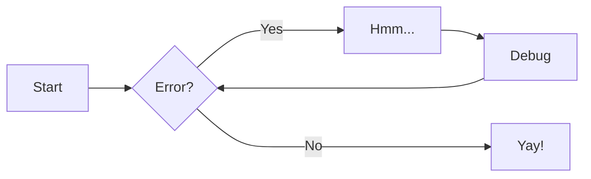
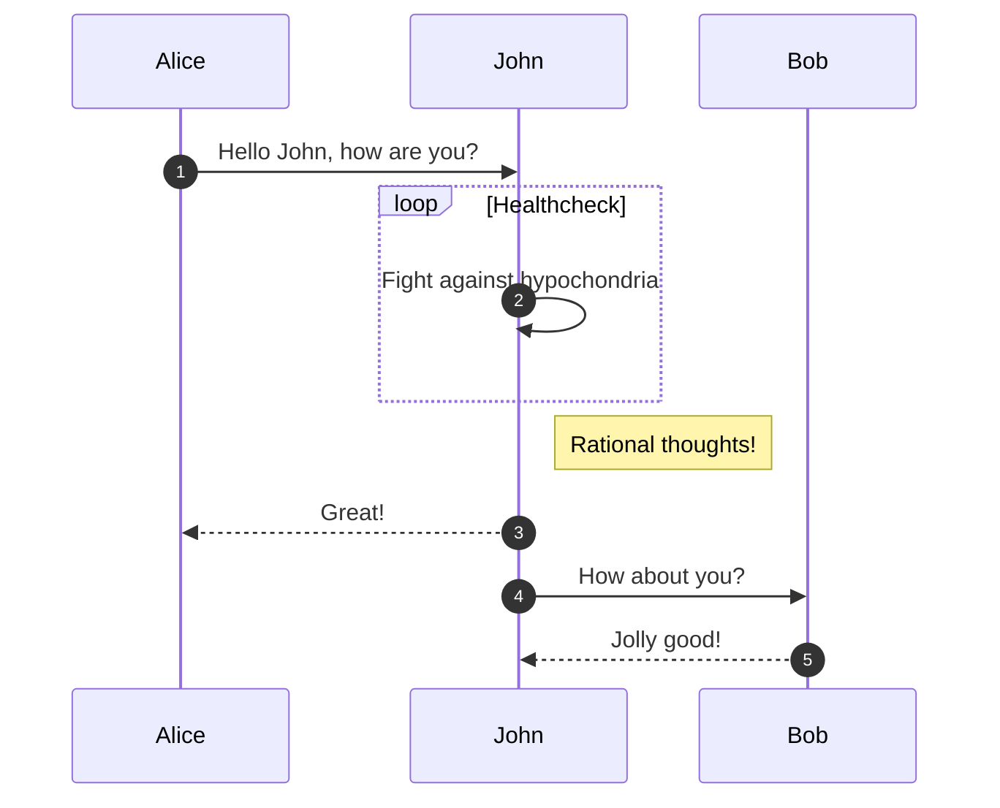

# Welcome to MkDocs

This documentation to practice mkdocs. See full documentation [here](https://squidfunk.github.io/mkdocs-material/reference/)

## Admonitions

!!! note

    Lorem ipsum dolor sit amet, consectetur adipiscing elit. Nulla et euismod
    nulla. Curabitur feugiat, tortor non consequat finibus, justo purus auctor
    massa, nec semper lorem quam in massa.

??? note

    Lorem ipsum dolor sit amet, consectetur adipiscing elit. Nulla et euismod
    nulla. Curabitur feugiat, tortor non consequat finibus, justo purus auctor
    massa, nec semper lorem quam in massa.

???+ note

    Lorem ipsum dolor sit amet, consectetur adipiscing elit. Nulla et euismod
    nulla. Curabitur feugiat, tortor non consequat finibus, justo purus auctor
    massa, nec semper lorem quam in massa.

!!! info inline end "Lorem ipsum"

    Lorem ipsum dolor sit amet, consectetur
    adipiscing elit. Nulla et euismod nulla.
    Curabitur feugiat, tortor non consequat
    finibus, justo purus auctor massa, nec
    semper lorem quam in massa.

Lorem ipsum dolor sit amet, consectetur adipiscing elit. Nulla et euismod nulla. Curabitur feugiat, tortor non consequat finibus, justo purus auctor massa, necsemper lorem quam in massa. Lorem ipsum dolor sit amet, consectetur adipiscing elit. Nulla et euismod nulla. Curabitur feugiat, tortor non consequat finibus, justo purus auctor massa, necsemper lorem quam in massa. Lorem ipsum dolor sit amet, consectetur adipiscing elit. Nulla et euismod nulla. Curabitur feugiat, tortor non consequat finibus, justo purus auctor massa, necsemper lorem quam in massa.

!!! Abstract
    Lorem ipsum dolor sit amet, consectetur adipiscing elit. Nulla et euismod nulla. Curabitur feugiat, tortor non consequat finibus, justo purus auctor massa, necsemper lorem quam in massa.

!!! tip
    Lorem ipsum dolor sit amet, consectetur adipiscing elit. Nulla et euismod nulla. Curabitur feugiat, tortor non consequat finibus, justo purus auctor massa, necsemper lorem quam in massa.

!!! Success
    Lorem ipsum dolor sit amet, consectetur adipiscing elit. Nulla et euismod nulla. Curabitur feugiat, tortor non consequat finibus, justo purus auctor massa, necsemper lorem quam in massa.

!!! question
    Lorem ipsum dolor sit amet, consectetur adipiscing elit. Nulla et euismod nulla. Curabitur feugiat, tortor non consequat finibus, justo purus auctor massa, necsemper lorem quam in massa.

!!! warning
    Lorem ipsum dolor sit amet, consectetur adipiscing elit. Nulla et euismod nulla. Curabitur feugiat, tortor non consequat finibus, justo purus auctor massa, necsemper lorem quam in massa.

!!! failure
    Lorem ipsum dolor sit amet, consectetur adipiscing elit. Nulla et euismod nulla. Curabitur feugiat, tortor non consequat finibus, justo purus auctor massa, necsemper lorem quam in massa.

!!! danger
    Lorem ipsum dolor sit amet, consectetur adipiscing elit. Nulla et euismod nulla. Curabitur feugiat, tortor non consequat finibus, justo purus auctor massa, necsemper lorem quam in massa.

!!! bug
    Lorem ipsum dolor sit amet, consectetur adipiscing elit. Nulla et euismod nulla. Curabitur feugiat, tortor non consequat finibus, justo purus auctor massa, necsemper lorem quam in massa.

!!! example
    Lorem ipsum dolor sit amet, consectetur adipiscing elit. Nulla et euismod nulla. Curabitur feugiat, tortor non consequat finibus, justo purus auctor massa, necsemper lorem quam in massa.

!!! example "Example with custom title"
    Lorem ipsum dolor sit amet, consectetur adipiscing elit. Nulla et euismod nulla. Curabitur feugiat, tortor non consequat finibus, justo purus auctor massa, necsemper lorem quam in massa.

!!! quote "Custom title"
    Lorem ipsum dolor sit amet, consectetur adipiscing elit. Nulla et euismod nulla. Curabitur feugiat, tortor non consequat finibus, justo purus auctor massa, necsemper lorem quam in massa.

!!! pied-piper "Pied Piper"

    Lorem ipsum dolor sit amet, consectetur adipiscing elit. Nulla et
    euismod nulla. Curabitur feugiat, tortor non consequat finibus, justo
    purus auctor massa, nec semper lorem quam in massa.

## Annotations

Lorem ipsum dolor sit amet, (1) consectetur adipiscing elit.
{ .annotate }

1. This is for annotation (1)

Another annotation (1)
{ .annotate }

1. Annotation in markdown languages: **bold**, _italic_, $a^2+b^2 = c^2$

!!! note annotate "Phasellus posuere in sem ut cursus (1)"

    Lorem ipsum dolor sit amet, (2) consectetur adipiscing elit. Nulla et
    euismod nulla. Curabitur feugiat, tortor non consequat finibus, justo
    purus auctor massa, nec semper lorem quam in massa.

1.  :man_raising_hand: I'm an annotation!
2.  :woman_raising_hand: I'm an annotation as well!

=== "Tab 1"

    Lorem ipsum dolor sit amet, (1) consectetur adipiscing elit.
    { .annotate }

    1.  :man_raising_hand: I'm an annotation!

=== "Tab 2"

    Phasellus posuere in sem ut cursus (1)
    { .annotate }

    1.  :woman_raising_hand: I'm an annotation as well!

## Button

[Regular button](#){ .md-button }

[Primary Button](#){ .md-button .md-button--primary }

[:fontawesome-solid-paper-plane: Button with icon](#){ .md-button }

## Code blocks

### Allow copy

```{ .python }
# This is a sample Python code
import os
import glob

print("Hello")
```

### Allow select

```{ .python .select}
# This is a sample Python code
import os
import glob

print("Hello")
```

### Not allow copy

```{ .python .no-copy}
# This is a sample Python code
import os
import glob

print("Hello")
```

### Code annotations

```python
print("Hello World") # (1)
```

1.  This line print `Hello World` to the screen

### Simple code block

```python
import os
import glob

print("Hello")
```

### Code block with title

```py title="bubble_sort.py"

def bubble_sort(items):
    for i in range(len(items)):
        for j in range(len(items) - 1 - i):
            if items[j] > items[j + 1]:
                items[j], items[j + 1] = items[j + 1], items[j]
```

### Code block with line numbers

```py linenums="1"
def bubble_sort(items):
    for i in range(len(items)):
        for j in range(len(items) - 1 - i):
            if items[j] > items[j + 1]:
                items[j], items[j + 1] = items[j + 1], items[j]
```

### Code block with highlighting lines

Specific lines

```py hl_lines="2 5"
def bubble_sort(items):
    for i in range(len(items)):
        for j in range(len(items) - 1 - i):
            if items[j] > items[j + 1]:
                items[j], items[j + 1] = items[j + 1], items[j]
```

Line ranges

```py hl_lines="2-5"
def bubble_sort(items):
    for i in range(len(items)):
        for j in range(len(items) - 1 - i):
            if items[j] > items[j + 1]:
                items[j], items[j + 1] = items[j + 1], items[j]
```

### Highligting inline code blocks

The `#!python range(a, b)` function is used to generate a sequence of numbers from `a` to `b - 1`.

### Browse from file

```cpp
--8<-- "helloworld.cpp"
```

### Custom syntax

See [here](https://squidfunk.github.io/mkdocs-material/reference/code-blocks/#customization).

## Content tabs

Basic
=== "C"

    ``` c
    #include <stdio.h>

    int main(void) {
      printf("Hello world!\n");
      return 0;
    }
    ```

=== "C++"

    ``` c++
    #include <iostream>

    int main(void) {
      std::cout << "Hello world!" << std::endl;
      return 0;
    }
    ```

Embedded
!!! example

    === "Unordered List"

        ``` markdown
        * Sed sagittis eleifend rutrum
        * Donec vitae suscipit est
        * Nulla tempor lobortis orci
        ```

    === "Ordered List"

        ``` markdown
        1. Sed sagittis eleifend rutrum
        2. Donec vitae suscipit est
        3. Nulla tempor lobortis orci
        ```

## Data tables

| Method   | Description                          |
| -------- | ------------------------------------ |
| `GET`    | :material-check: Fetch resource      |
| `PUT`    | :material-check-all: Update resource |
| `DELETE` | :material-close: Delete resource     |

See [here](https://squidfunk.github.io/mkdocs-material/reference/data-tables) for more.

## Diagrams

### Flowchart



### Sequence diagrams



### Others diagram types

See [here](https://squidfunk.github.io/mkdocs-material/reference/diagrams).

## Footnotes

Lorem ipsum[^1] dolor sit amet, consectetur adipiscing elit.[^2]

## Formatting

Text can be {--deleted--} and replacement text {++added++}. This can also be
combined into {~~one~>a single~~} operation. {==Highlighting==} is also
possible {>>and comments can be added inline<<}.

{==

Formatting can also be applied to blocks by putting the opening and closing
tags on separate lines and adding new lines between the tags and the content.

==}

-   ==This was marked (highlight)==
-   ^^This was inserted (underline)^^
-   ~~This was deleted (strikethrough)~~

Text with sub- and superscripts

-   H~2~O
-   A^T^A

Keyboard keys

++ctrl+alt+del++

++ctrl+a+enter++

++cmd+opt+a++

See [here](https://facelessuser.github.io/pymdown-extensions/extensions/keys/#extendingmodifying-key-map-index) for all keys

## Grids

Card grids:

<div class="grid cards" markdown>

-   :fontawesome-brands-html5: **HTML** for content and structure
-   :fontawesome-brands-js: **JavaScript** for interactivity
-   :fontawesome-brands-css3: **CSS** for text running out of boxes
-   :fontawesome-brands-internet-explorer: **Internet Explorer** ... huh?

-   :material-clock-fast:{ .lg .middle } **Set up in 5 minutes**

    ***

    Install [`mkdocs-material`](#) with [`pip`](#) and get up
    and running in minutes

    [:octicons-arrow-right-24: Getting started](#)

-   :fontawesome-brands-markdown:{ .lg .middle } **It's just Markdown**

    ***

    Focus on your content and generate a responsive and searchable static site

    [:octicons-arrow-right-24: Reference](#)

-   :material-format-font:{ .lg .middle } **Made to measure**

    ***

    Change the colors, fonts, language, icons, logo and more with a few lines

    [:octicons-arrow-right-24: Customization](#)

-   :material-scale-balance:{ .lg .middle } **Open Source, MIT**

    ***

    Material for MkDocs is licensed under MIT and available on [GitHub]

    [:octicons-arrow-right-24: License](#)

</div>

Generic

<div class="grid" markdown>

=== "Unordered list"

    * Sed sagittis eleifend rutrum
    * Donec vitae suscipit est
    * Nulla tempor lobortis orci

=== "Ordered list"

    1. Sed sagittis eleifend rutrum
    2. Donec vitae suscipit est
    3. Nulla tempor lobortis orci

```title="Content tabs"
=== "Unordered list"

    * Sed sagittis eleifend rutrum
    * Donec vitae suscipit est
    * Nulla tempor lobortis orci

=== "Ordered list"

    1. Sed sagittis eleifend rutrum
    2. Donec vitae suscipit est
    3. Nulla tempor lobortis orci
```

</div>

## Icons, Emojis

:smile:

More emoji:

-   :material-material-design: – [Material Design](https://materialdesignicons.com/)
-   :fontawesome-brands-font-awesome: – [FontAwesome](https://fontawesome.com/search?m=free)
-   :octicons-mark-github-16: – [Octicons](https://octicons.github.com/)
-   :simple-simpleicons: – [Simple Icons](https://simpleicons.org/)

## Images


## Lists

Unordered:

- Nulla et rhoncus turpis. Mauris ultricies elementum leo. Duis efficitur
  accumsan nibh eu mattis. Vivamus tempus velit eros, porttitor placerat nibh
  lacinia sed. Aenean in finibus diam.

    * Duis mollis est eget nibh volutpat, fermentum aliquet dui mollis.
    * Nam vulputate tincidunt fringilla.
    * Nullam dignissim ultrices urna non auctor.

Ordered:

1.  Vivamus id mi enim. Integer id turpis sapien. Ut condimentum lobortis
    sagittis. Aliquam purus tellus, faucibus eget urna at, iaculis venenatis
    nulla. Vivamus a pharetra leo.

    1.  Vivamus venenatis porttitor tortor sit amet rutrum. Pellentesque aliquet
        quam enim, eu volutpat urna rutrum a. Nam vehicula nunc mauris, a
        ultricies libero efficitur sed.

    2.  Morbi eget dapibus felis. Vivamus venenatis porttitor tortor sit amet
        rutrum. Pellentesque aliquet quam enim, eu volutpat urna rutrum a.

        1.  Mauris dictum mi lacus
        2.  Ut sit amet placerat ante
        3.  Suspendisse ac eros arcu

Tasks

-   [x] Lorem ipsum dolor sit amet, consectetur adipiscing elit
-   [ ] Vestibulum convallis sit amet nisi a tincidunt
    -   [x] In hac habitasse platea dictumst
    -   [x] In scelerisque nibh non dolor mollis congue sed et metus
    -   [ ] Praesent sed risus massa
-   [ ] Aenean pretium efficitur erat, donec pharetra, ligula non scelerisque

## Math

$$ \tag{1}
c^2 = a^2 + b^2
$$

$$ \tag{2}
\operatorname{ker} f=\{g\in G:f(g)=e_{H}\}{\mbox{.}}
$$

The homomorphism $f$ is injective if and only if its kernel is only the
singleton set $e_G$, because otherwise $\exists a,b\in G$ with $a\neq b$ such
that $f(a)=f(b)$.

Ref to $\ref{1}$

## Tooltips

[Hover me](https://example.com "I'm a tooltip!")

[Hover me][example] :material-information-outline:{ title="Important information" }

  [example]: https://example.com "I'm a tooltip!"

The HTML specification is maintained by the W3C.